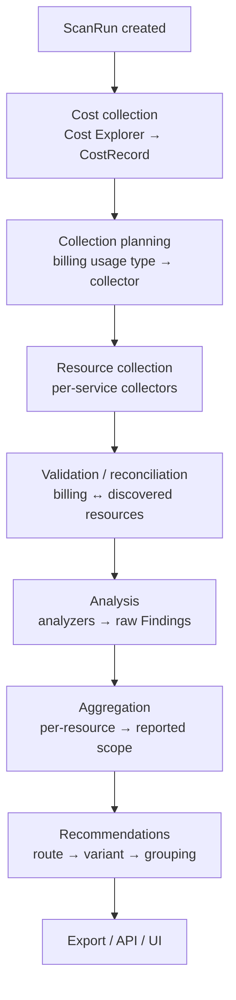

# AWS Cost Optimizer — Architecture & Code Review

> **Part A** documents how the system actually works, layer by layer.
> **Part B** is a prioritized review of defects found in that code.
>
> Everything marked ✅ **verified** was confirmed by reading the code, querying the
> live database, or reproducing the behaviour — not inferred.

---

# Part A — Architecture

## A.0 The three components

| Component | Path | Role |
|---|---|---|
| **Scan engine** | `aws_cost_optimizer/` | Collects AWS cost + resource data, produces findings and recommendations. Pure Python, no web framework. |
| **Backend** | `backend/` | FastAPI app wrapping the engine, persisting to SQLite, serving REST. |
| **Frontend** | `frontend/` | React + Vite SPA that starts scans and renders dashboards/results. |

There are **two entry points that run the same pipeline**:

- `python aws_cost_optimizer/main.py …` — CLI, synchronous, **writes `scans/scan_<id>/summary.txt`**.
- `POST /api/scans` → `ScanService.run()` in a background thread — **does not write `summary.txt`** ✅ *(verified: `ScanExporter` has zero references in `scan_service.py`)*.

Both persist to the same SQLite database.

## A.1 The `sys.path` bootstrap (read this first)

The engine was written with **bare top-level imports** (`from collectors.registry import …`), which only resolve if `aws_cost_optimizer/` is itself on `sys.path`. Backend code, meanwhile, imports the same modules as `aws_cost_optimizer.collectors.…`.

`backend/bootstrap.py::ensure_project_paths()` inserts **both** the repo root and `aws_cost_optimizer/` onto `sys.path`, and is called at the top of `backend/main.py`, `backend/api/main.py`, and `aws_cost_optimizer/main.py` before any project import.

> **When adding an entry point, call it first.** Otherwise the mixed import styles fail depending on how the process was launched — and the same module can be imported twice under two names, producing two separate registries.

## A.2 Pipeline overview



## A.3 Layer by layer

### 1. Orchestration
**`aws_cost_optimizer/main.py`** (CLI) and **`backend/api/services/scan_service.py`** (API) run the same 8 stages. ScanService additionally reports progress (5 → 15 → 25 → 55 → 65 → 90 → 100) and flips scan status.

**Output:** a `ScanRun` row that all later stages attach to.

### 2. Cost collection — `collectors/cost/`
`CostCollector.collect(db, scan)` resolves regions with spend, then calls `get_cost_usage(start, end, region)` per region.

`cost_explorer.py` fetches with `Granularity=MONTHLY`, grouped by `SERVICE` + `USAGE_TYPE`, through a module-global month cache (`_MONTH_CACHE`): closed months cached indefinitely, the open month on a 300 s TTL. `_validate()` re-queries ungrouped monthly totals and compares.

**Output:** `CostRecord` rows `(service, usage_type, region, month, amount)` + a validation block `{collected_total, monthly_total, difference, matches, …}`.

> ⚠️ This layer currently widens the requested window to whole months — see **C1**.

### 3. Planning — `planner/`
`CollectionPlanner.plan()` groups `CostRecord` by `(service, usage_type, region)`, filters `HAVING sum >= cost_threshold`, orders by cost desc, and asks `CatalogResolver.resolve(service, usage_type)` to map each to a collector.

Two YAML files with **distinct responsibilities**:

| File | Answers |
|---|---|
| `planner/resource_catalog.yaml` | *Which collector owns this billing usage type?* Billing service names, usage-type glob patterns, collector key, resource type, enable flag. |
| `planner/collection_profiles.yaml` | *What should that collector gather?* Per-section enable flags, identity/configuration field maps, CloudWatch namespace + metric list, analyzer thresholds. |

Unmatched billing is persisted as a plan with `status="unmatched"` rather than dropped.

**Output:** collection plans `{service, region, usage_type, resource_type, collector, priority, cost_context}`.

### 4. Resource collection — `collectors/`
`CollectorManager.execute()` looks up the collector class, fetches its profile via `CollectionProfile.get(resource_type)`, and runs `BaseCollector.collect()`.

The lifecycle, per resource:

```
discover()  →  identity → configuration → relationships
            →  observations → topology
            →  optimization_evidence → data_quality
```

Each section runs inside `_safe_collect_section`, which on failure writes `{"status": "error", …}` and records into `collection_errors` — so one broken section degrades that section only.

**The normalized resource document** (the engine's central data structure):

```python
{
  "resource_id", "resource_type", "region",
  "collection_status",            # complete | partial
  "collection_errors",
  "identity", "configuration", "relationships",
  "observations",                 # .cloudwatch.metrics, .cloudtrail, …
  "topology",
  "optimization_evidence",        # analyzer-facing digest
  "data_quality",
  "raw",                          # untouched AWS response
  "cost_context",                 # stamped by the manager, post-collect
}
```

CloudWatch is fetched either batched (`collect_batch` → `GetMetricData`, used by NAT/TGW/EKS/QuickSight) or per-resource (`collect` → `GetMetricStatistics`, still used by ELB/RDS — see **M3**).

### 5. Validation / reconciliation — `collection/`
`validate_collection_results(plans, results)` pairs each plan to its result, then `reconcile_collection_plan()` decides how billing relates to what was discovered:

| Status | Meaning |
|---|---|
| `current` | Resources discovered; usage type can't identify individuals, so billing stays plan-level evidence. |
| `current_mismatch` | Billing describes a different configuration than the live resource (e.g. `db.t3.large` billed, `db.r6g.large` found). Billing kept as historical evidence only. |
| `historical` | Spend exists, no current resource. No resource-level recommendation possible. |
| `no_cost` / `unknown` | No spend / undetermined. |

Non-`current` states emit **data-quality findings**, which is why the report separates "Optimization findings" from "Data quality".

### 6. Analysis — `analysis/`
`AnalysisEngine.analyze()` wraps each resource in an `AnalysisContext` (the stable accessor API: `configuration()`, `observations()`, `metrics()`, `metric_summary()`, `topology()`, `billing()`, `optimization_evidence()`), then for each registered analyzer calls `supports(context)` then `analyze(context)`.

`_normalize_finding()` backfills what analyzers shouldn't hardcode — notably `metadata["service"]` from the catalog-derived billing service via `setdefault` — then computes `finding_key` and a stable id, and deduplicates.

**Findings vs. aggregation are deliberately separate.** A DB `Finding` row is always the **raw, resource-level fact**: 3 idle NAT gateways persist as **3 rows**. `FindingAggregator` then decides the *reported* scope (per-resource / region / account / service), producing the single "Resources: 3" entry the UI shows.

**Analyzer contract:** return `Finding` objects with `conditions: list[EvidenceStatement]` (these auto-render into `evidence_summary` bullets), an `Evidence` object, `limitations`, and `recommendation_eligible`.

> ⚠️ The engine catches per-analyzer exceptions and continues. This makes an interface mismatch **silent** — see **C4**.

### 7. Recommendations — `recommendations/`
Per aggregated finding: eligibility check → route lookup in `recommendation_rules.yaml` → variant → scope resolution → grouping by `(recommendation_key, variant_key, resource_type, scope)` → `Recommendation`.

```yaml
recommendations:            # the catalog
  review_unused_resource:
    variants:
      rds_stopped: {title: …, reason: "{count} … {plural}", action: …}
routes:                     # finding_type → catalog entry
  rds_stopped_instance:
    recommendation_key: review_unused_resource
    variant_key: rds_stopped
```

**Template contract:** only `{count}` and `{plural}` are substituted. An unknown placeholder raises `KeyError`, which is caught and returns the **raw unrendered template** to the user.

**Every `recommendation_eligible=True` finding type must have a route**, or it produces a finding with no recommendation, silently.

### 8. Export, API, UI
- **Export:** `ScanExporter` writes `scans/scan_<id>/summary.txt`. CLI only.
- **Backend:** `routes/*` → `services/*` → `repositories/*` → `models/*`; `presenters/*` shape responses. `POST /api/scans` spawns a `threading.Thread` running `ScanService(db).run(scan)` on **its own `SessionLocal()`** — the request's session must never cross into the worker.
- **Frontend:** `api/client.js` is the single fetch wrapper; hooks (`useScan`, `useScanResults`, `useDashboard`, `useDashboardScan`) own fetch/loading/error state and poll `GET /api/scans/{id}` every 3 s until terminal, then load findings/recommendations/cost data.

## A.4 Contracts between layers

The couplings that break silently when one side is renamed:

| Producer | Key | Consumer |
|---|---|---|
| `resource_catalog.yaml` `collector.resource_type` | resource-type string | `CollectionProfile.get()` — miss returns `{}`, no error |
| `CollectorManager` | `resource["cost_context"]["service"]` | `engine._normalize_finding()` → `metadata["service"]` |
| `BaseCollector` | top-level `data_quality` | `context.data_quality()` reads `observations.data_quality` ⚠️ **mismatched — C3** |
| Collector | `observations.cloudwatch.metrics[*]` | `context.metric_summary(name)` |
| Analyzer | `finding_type` | `recommendation_rules.yaml` `routes:` |
| Catalog | `variant_key` | `recommendations.*.variants` |
| Analyzer | `Finding.impact` | `_aggregate_impact` → `financial_impact` ⚠️ **never populated — C2** |
| Presenter | response keys | `frontend/src/data/findings.js` |

---

# Part B — Review findings

Severity: **Critical** = wrong numbers or lost functionality in normal use · **High** = breaks in common conditions · **Medium** = correctness/performance debt · **Low** = hygiene.

## Critical

### C1 ✅ Cost windows are silently widened to whole months
**`collectors/cost/cost_explorer.py:155-161`** — *(regression introduced during this session's caching work)*

`_fetch_monthly_with_cache()` rounds the fetch to `_month_start_date(missing[0])` → `_month_end_date_exclusive(missing[-1])` and returns whole-month blocks **with no trimming** back to the requested window (`:194-198`, granularity `MONTHLY`).

**Proof from your own scans** — same period `2026-06-15 → 2026-08-16`:

| Scan | June (closed month) | Period total |
|---|---|---|
| #18 | **$295.62** | $1,109.56 |
| #27 | **$555.00** | $1,387.40 |

A closed month cannot change. The delta is June 1–14 — spend outside the requested window. **Validation still reports PASS** because `get_monthly_totals()` is widened identically, so it compares two equally-wrong numbers.

Every `CostRecord`, every plan's `cost_context`, and every cost figure in the report and dashboard inherits this.

**Fix:** trim returned blocks to the requested `[start, end)` before use, or cache month blocks but slice on read. Add a validation assertion that the summed record window equals the requested window.

### C2 ✅ The headline savings number is structurally unreachable
**`analysis/financial.py:33`, `main.py:251`**

`calculate_savings()` has **exactly one occurrence in the repo — its own definition**. No analyzer populates `Finding.impact` (NAT and TGW pass `impact={}` explicitly; the rest take the empty default). So `_aggregate_impact` always sees `observed_monthly_cost = None`, and `_build_financial_impact` always returns an all-`None` block: **`estimated_monthly_savings` can never be non-null.**

Compounding it: `main.py:251` hardcodes `attribution_scope="collection_plan"`, and `calculate_savings` returns `None` for any scope but `"resource"` — so wiring it up alone wouldn't help.

**Fix:** decide deliberately whether resource-level attribution is achievable. If not, remove the dead path and stop implying a savings figure exists. If yes, flow `reconcile_collection_plan`'s `RESOURCE` scope back into `cost_context` and populate `Finding.impact`.

### C3 ✅ `context.data_quality()` reads a key almost nothing writes
**`collectors/base.py:261-265` vs `analysis/context.py:331`**

`BaseCollector` writes `data_quality` at the **top level** of the resource document; `AnalysisContext.collector_data_quality()` reads `observations["data_quality"]`. Only the NAT collector happens to also write it inside `observations`.

RDS, ELB and QuickSight findings therefore carry an **empty** data-quality block while appearing to carry real evidence — the opposite of this project's "missing evidence must lower confidence" principle.

**Fix:** read the top-level key (with a fallback to the nested one for NAT), and add a contract test.

### C4 ✅ Analyzer failures are silent by design
**`analysis/engine.py:70-100`**

Both `supports()` and `analyze()` are wrapped in `except Exception: … continue`. An analyzer that raises on *every* resource — an interface mismatch, a missing attribute, a bad constructor kwarg — produces **zero findings with no visible error**. This session hit exactly that twice (NAT and RDS), and neither surfaced in a scan that otherwise looked healthy.

**Fix:** keep catching per-resource data errors, but treat `AttributeError`/`TypeError` as fatal, and emit a scan-level warning when a registered analyzer yields zero findings across all resources it claims to support.

## High

### H1 ✅ 19 scans stuck forever; every "completed" scan reads 99%
**`backend/database/scan_recovery.py:16`, `scan_run_repository.py:94-97`**

Live DB: `pending: 19, completed: 12, failed: 1` — and **every** completed row has `progress_percent = 99.0`.

- `recover_stuck_scans()` has **zero call sites**, while the worker is `daemon=True` — any reload/crash orphans the row permanently.
- It only looks for `status == "running"`, so it would miss all 19 `pending` rows even if called.
- `update_scan_progress` clamps `min(99.0, …)`, so the final `_report_progress(scan, 100)` can never land.

**Fix:** call recovery on startup, widen it to `pending`, and let the terminal update write 100.

### H2 ✅ Migration gaps break any pre-existing database
**`backend/database/models_loader.py:30-80`**

`init_db()` guards 3 columns; commit `d06ae9a` added ~19 across `findings` and `recommendations` with no guarded `ALTER TABLE`. `create_all()` never alters existing tables — and the whole block is `except Exception: pass`, so failure is invisible until a query raises `no such column`.

**Fix:** add the missing guarded ALTERs, log failures instead of swallowing, and consider adopting Alembic.

### H3 ✅ Both "View Results" buttons pass a click event as the scan ID
**`frontend/src/components/ScanPage.jsx:294, :432`** — `onClick={onViewResults}` makes the SyntheticEvent the scan id → `/api/scans/[object%20Object]`.
**Fix:** `onClick={() => onViewResults(scanData?.id)}`.

### H4 ✅ A 20 MB database is committed, and the committed tree doesn't build
`aws_optimizer.db` is tracked and rewritten by every scan — each commit adds a ~20 MB blob containing real account IDs, ARNs and cost data. Meanwhile `CostByServiceTable.jsx` / `RegionBreakdownPanel.jsx` are deleted from disk but still tracked, and `CostDriversPanel.jsx`, `CostDriverList.jsx`, `DonutChart.jsx`, `CollectionSummaryModal.jsx` are imported but untracked.

**Fix:** `git rm --cached aws_optimizer.db`, add `*.db` to `.gitignore`, purge history if it has several revisions, and commit the new components.

### H5 A transient poll failure aborts the whole scan UI
**`frontend/src/hooks/useScan.js:171-187`** — one failed `getScan` (dropped request, backend restart) sets `status:'idle'` and stops polling permanently, while the backend scan runs to completion. User sees failure for a successful scan.
**Fix:** tolerate N consecutive failures before giving up.

### H6 Non-atomic scan writes
**`scan_service.py:97, :458, :619, :796`** — progress/stage commits mean a later failure leaves earlier cost records, plans and findings committed under a scan marked `failed`. `scan_recovery` even treats "has cost records" as proof of success.

### H7 No authentication on any endpoint
Including `DELETE /api/scans/{id}` and endpoints triggering billable Cost Explorer calls (`force_refresh=true`) — a cost-amplification vector. CORS is hardcoded with `allow_credentials=True`.

## Medium

- **M1** ✅ **Planner discards secondary usage-type cost.** `planner.py:82-88` keeps one plan per `(collector, region, resource_type)`; since the query is `ORDER BY sum DESC`, the `if total_cost > …` branch is **unreachable dead code** and additional usage types are never summed. NAT billed `$500 Hours + $300 Bytes` reports `$500`.
- **M2** **Confidence aggregated lowest, then republished highest.** `aggregation.py:396-401` takes the **lowest** confidence across a group; `recommendations/engine.py:748-752` takes the **highest**. One `high` + four `low` findings ⇒ a `high` recommendation.
- **M3** **N+1 CloudWatch calls in ELB and RDS.** `elb.py:1780`, `rds.py:924` call `collect()` per resource per metric; NAT/TGW/EKS/QuickSight already use `collect_batch`. 50 instances × 8 metrics ≈ 400 calls instead of ~1.
- **M4** **Three shadowed duplicate API routes.** `scans.py` and `scan_results.py` both mount `/api/scans` and both define `/{scan_id}`, `/cost-summary`, `/cost-trend`. Include order decides the winner and the shapes differ — which is why `client.js:203` needs a `response.scan ?? response` guard.
- **M5** **Unbounded, credential-agnostic cost cache.** `dashboard_service.py:57` `_QUERY_CACHE` never expires closed ranges, has no size cap, and its key omits the AWS account — changed credentials can serve another account's costs.
- **M6** **N+1 in `get_scan_summary`.** `len(scan.findings)` / `len(scan.recommendations)` lazy-load every row, called per scan in list endpoints and on every dashboard poll. Should be two `func.count()` scalars.
- **M7** **`POST /api/scans` reports `status:"running"`** while the row is `"pending"`.
- **M8** **Backend-down renders as "no data".** `App.jsx:74`, `ScanPage.jsx:67`, `CostDriversPanel.jsx:424` swallow fetch errors with bare catches; the user sees an empty state, not an error. No retry anywhere.
- **M9** **Stale-closure double-load race** after a scan finishes (`App.jsx:85-108`) — two unguarded `loadResults` calls race with no sequence token; the older scan's results can land last.
- **M10** **`useDashboardScan` polling never terminates** — no attempt cap, unlike `useScan`.
- **M11** **Hydration is a strict-kwargs contract.** `finding_repository.py:360-382` does `Evidence(**data)` on persisted JSON — any engine-side field rename makes old rows raise `TypeError` → unhandled 500.
- **M12** **Silent-failure paths masking AWS errors:** `registry.py:44` records import errors nothing reads; `quicksight.py:173` `except Exception: pass` around `get_caller_identity()` corrupts resource identity; `vpc_endpoint.py:644,789,814` `except Exception: continue` silently drops topology edges that later read as "no route dependency".

## Low

- **L1** Exporter reads `impact["period_cost"]`, a key nothing produces; recommendations render with no financial figure at all.
- **L2** `topology_resources` counts `disabled` and `error` topology as collected (both truthy).
- **L3** Closed-month cache entries never expire — late charges/credits invisible until restart.
- **L4** Dead code: `validation.build_historical_unmatched_finding` always returns `None`; `main.py` reads `result["not_found"]`, never written; `metrics_collected`/`metrics_observed` computed from identical expressions; `backend/database/init_db.py` is a second `init_db()` **without** migrations; `schemas/finding.py` is corrupted (duplicate docstring + `FindingListResponse` declared twice) and types `confidence` as `float` while the model stores a string.
- **L5** Repeated YAML parsing — `ResourceCatalog()` re-parsed instead of using the `load_catalog()` singleton; route lookups repeated up to 4× per finding.
- **L6** `config/settings.py:8-9` pins `DEFAULT_START_DATE`/`DEFAULT_END_DATE` to fixed past dates.
- **L7** Fragile CSP/HMR coupling in `vite.config.ts` — the regex strip only works because `hmr:false`; version-coupled to Vite's injected markup.

## Cross-cutting

- **No tests anywhere** ✅ — zero `test_*.py`, `*.test.js*`, `conftest.py`, `pytest.ini` across all three components. Nothing catches C3, C4, H3 or a presenter field rename. Highest-value first step: FastAPI `TestClient` contract tests pinning the exact keys each presenter emits.
- **No Python dependency manifest** ✅ — no `requirements.txt`/`pyproject.toml`. A fresh clone cannot be installed. Needs at minimum `fastapi`, `uvicorn`, `sqlalchemy`, `pydantic`, `boto3`, `PyYAML`.
- **Lint configured but unenforceable** — `.oxlintrc.json` exists; `oxlint` isn't in `devDependencies`.
- **No secrets committed** ✅ — swept clean. The residual exposure is the committed database (H4).

## Suggested fix order

1. **C1** — every number in the product is currently wrong.
2. **H4** — stop committing the DB; make the tree buildable.
3. **C4 + C3** — make silent failures loud, then fix the evidence contract.
4. **H1, H2** — scan lifecycle and migrations.
5. **H3, H5, M8** — the three user-visible frontend breakages.
6. **C2** — decide what the savings story actually is.
7. Add the dependency manifest + first contract tests, then work the Medium list.
